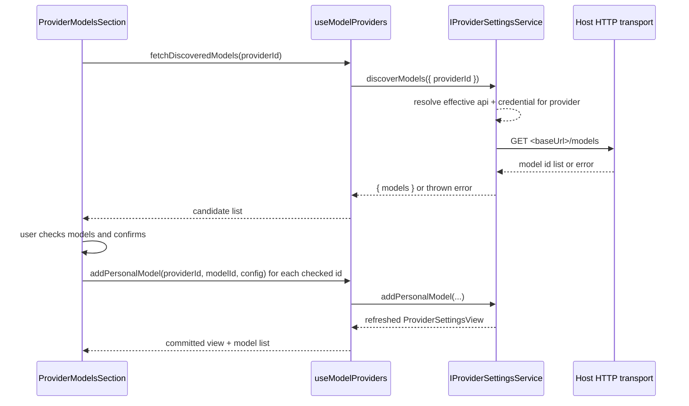

# Custom provider model discovery

Status: Implemented

## Product behavior

Custom providers can discover their model list from the provider's own `/models`
endpoint instead of requiring the user to type every model ID by hand.

- The provider detail page offers a **Fetch models** action next to **Add model**.
- Fetching calls the provider endpoint derived from the provider's effective Base URL
  and API type, using the provider's stored credential. It is a read-only probe; it
  never writes provider or model configuration.
- The response is shown as a checklist. Every discovered model ID is listed with a
  checkbox. Model IDs already present in the provider (built-in or personal) are
  shown as already added and cannot be selected again.
- The user selects which discovered models to add and confirms. Only the selected
  model IDs are persisted as personal models.
- Manual entry through **Add model** remains available and unchanged. Discovery never
  removes or replaces manual entry.
- After a discovered model is added, it behaves exactly like a manually added model:
  smart configuration, metadata editing, connectivity test, enable/disable, reorder,
  and deletion all apply.
- Selecting **Add** with nothing checked is rejected without a write.
- Discovery failures (network error, non-2xx response, unrecognizable body) surface an
  inline error message and leave configuration untouched.
- When discovery returns no model IDs, the dialog shows an English empty state.

## Ownership and boundary

`ProviderModelsSection` in `packages/ui/src/settings/model-provider-section/ProviderCardSections.tsx`
remains the single UI owner of the model list surface. `ModelProviderSection` and
`useModelProviders` remain the owner of the provider view, its revision, and the
model-membership write path.

Discovery is a new read-only operation on `IProviderSettingsService`
(`ServiceChannels.ProviderSettings`). It is a sibling of `testModelConnectivity`:

- It resolves the provider's effective API endpoint and credential inside the
  Environment that owns the provider config, so remote Environments probe their own
  endpoint with their own credential.
- It does not write to the provider config, does not bump the settings revision, and
  does not emit `onDidChange`.
- Adding the selected models reuses the existing `addPersonalModel` mutation path. No
  second persistence path is introduced; membership stays owned by
  `personalModelIds` plus `modelOrder`.
- The UI is a bounded overlay: it holds only the discovered candidate list, the
  checked set, and pending/failed status. It does not cache discoveries across
  provider switches.

The Desktop-to-Agent protocol does not change: discovery is implemented with the Host
HTTP transport that already serves provider connectivity.

## Event order

Adding discovered models is sequential and idempotent per model ID: a repeated add for
an already-present ID is a no-op in the existing mutation path. The overlay closes only
after every selected model has been committed or reported failed.

## Acceptance scenarios

1. A custom provider with a reachable `/models` endpoint lists discovered IDs in a
   checklist.
2. IDs already configured for that provider are marked added and cannot be selected.
3. Confirming with an empty selection performs no write and shows a validation message.
4. Confirming with a non-empty selection adds exactly the selected IDs and closes the
   overlay.
5. A discovery failure shows an inline English error and leaves the model list
   unchanged.
6. A change that introduces a new i18n key adds both the `en-US` and `zh-CN` entries.
